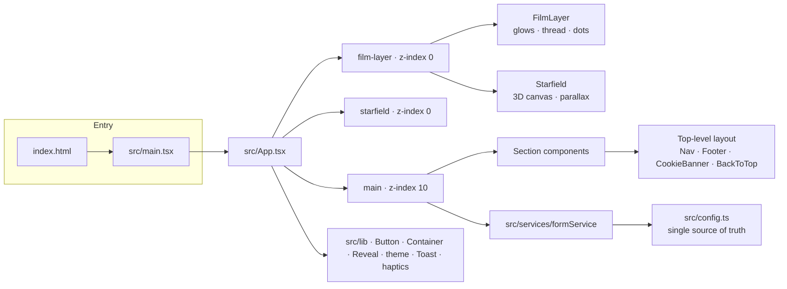

<p align="center">
  <br />
  
  
  
  
  
  
</p>

<h1 align="center">Brand<em>Bridge</em></h1>

<h3 align="center">The bridge between creators &amp; brands</h3>

<p align="center" id="tagline">
  We connect Instagram creators with brand collaborations that actually fit — on a transparent, creator-first 85 / 15 model.
</p>

<p align="center">
  <a href="https://brand-bridge.pages.dev"><b>🌐 Live Website</b></a> ·
  <a href="https://github.com/anurag290805/Brand_bridge"><b>🐙 GitHub Repository</b></a>
</p>

<!-- Press to preview the typing effect in a JS-capable Markdown viewer (VS Code, Typora).
     On GitHub, where scripts are stripped, the sentence above is shown statically. -->
<p align="center">
  <noscript><i>Bridging creators and brands through better partnerships.</i></noscript>
  <span id="typer"><i>Bridging creators and brands through better partnerships.</i></span>
</p>

<script>
  /* Lightweight decorative typing effect — works in JS-capable Markdown viewers,
     degrades gracefully to static text (e.g. on GitHub). */
  (function () {
    var el = document.getElementById('typer');
    if (!el) return;
    var text = 'Bridging creators and brands through better partnerships.';
    var i = 0;
    function step() {
      if (i <= text.length) { el.innerHTML = '<i>' + text.slice(0, i) + '</i>'; i++; setTimeout(step, 32); }
    }
    setTimeout(step, 350);
  })();
</script>

---

## 💡 What is BrandBridge?

**BrandBridge** is a focused platform connecting **Instagram creators** with **relevant brand collaboration opportunities**. It sits between the two sides to make sure the fit is genuine, the commercial terms are clear, and the campaign actually delivers.

> We look at **audience fit**, **engagement**, and **content style** — not vanity follower counts.

The site lives at **https://brand-bridge.pages.dev**, built and hosted free on **Cloudflare Pages**.

---

## 🧭 What the website does

BrandBridge is a **single-page marketing experience** that walks a cold-emailed creator (or brand) from curiosity → clarity → action in one continuous scroll. It is intentionally a **landing site for outreach** — there are no accounts, dashboards, or payments yet.

- **Tells the story** of what BrandBridge is and who it is for
- **Shows exactly how the money works** with an interactive 85 / 15 economics calculator
- **Explains the end-to-end process** from brief to delivery
- **Makes next steps effortless** — one short interest form, one CTA: **“Get started”**

---

## ✨ Features

### 🎬 Scroll-driven, cinematic animation experience
The whole page is a single **scroll-directed film**, not a stack of sections. Light fields drift at different rates as you scroll, a persistent “signal thread” draws a path through the atmosphere, and raised blocks step into focus as they enter the reading band.

### 🌌 Animated canvas starfield with mouse parallax
A hand-rolled **3D canvas starfield** sits fixed behind everything:
- Stars are projected from a 3D volume and drift toward the lens for a real depth effect
- Independent size, opacity, and twinkle phase per star
- Subtle **mouse parallax** eases the whole field as you move the pointer
- **Fewer stars on mobile** to protect frame-rate, and a `prefers-reduced-motion` fallback that turns it off entirely

### 🧮 Interactive campaign economics — the 85 / 15 split
“See exactly where it goes.” A **live calculator** shows the creator keeping **85%** and BrandBridge taking **15%**:
- Drag the campaign-value slider to see the real payout
- Toggle between **₹ INR** (10,000 – 500,000) and **$ USD** (500 – 25,000)
- Clearly labelled commission card: *Direct payout to creator* vs *BrandBridge commission*
- Figures are explicitly marked **illustrative** — no hidden fees, no onboarding cost

### 🎯 Matching
A criteria-led explainer of how BrandBridge matches creators and brands: **Audience Fit**, and related dimensions — relevance over follower count, no random cold pitches.

### 🔄 Process
A four-step, scroll-progressive workflow: **01 Tell us what you need → 02 We find the fit → 03 You align → 04 … → deliver**. Clear before it goes live. No surprises.

### 🪐 Niches
A symmetrical **constellation** of eight creator categories (Fashion, Beauty, Fitness, Food, Travel, Lifestyle, Entertainment, Gaming, and niche communities) orbiting the BrandBridge core.

### 📬 Opportunity preview
A designed, editorial-style **campaign brief** (clearly labelled illustrative): campaign type, creator niche, deliverables, and collaboration format.

### 🤝 Trust
Five editorial principles shown as a scroll-progressive sequence: *no exaggerated promises*, *you review first*, *clear details*, *you stay in control*, *we facilitate the connection*.

### ❓ FAQ
A clean accordion answering the real questions — what BrandBridge is, who can use it, how the 15% commission works, and whether figures are guaranteed.

### 👋 Contact / creator onboarding
A short form to signal interest (creator or brand), with validation, simulated submission, haptics on supported devices, and a toast confirmation. The submission layer is **abstracted** and safely posts to a configurable endpoint when one is wired up. *(See Roadmap.)*

### 📱 Responsive & native-performance
Every section is composed for mobile first-class. Animations use **only GPU-friendly `transform` and `opacity`** — no scroll-following JavaScript, no blur filters, no layout thrash.

---

## 🧰 Technology stack

| Layer | Choice | Why |
|-------|--------|-----|
| Framework | **React 18** (TypeScript) | Component model, strict typing, predictable rendering |
| Build tool | **Vite 6** | Instant dev server, fast production builds |
| Styling | **Tailwind CSS v4** (+ `vite` plugin) | Utility-first, design-token driven |
| Motion | **Motion 11** (Framer Motion’s successor) | Scroll-linked `useScroll` / `useTransform`, springs, `AnimatePresence` |
| Icons | **Phosphor Icons** | Consistent, tree-shakeable icon set |
| Background layers | Native `<canvas>` | Hand-rolled starfield (no heavy deps) |
| Hosting | **Cloudflare Pages** | Global CDN, free static hosting at `brand-bridge.pages.dev` |

> *The animation layer is **Motion**, not GSAP — chosen because it maps 1:1 to React’s render model and stays native to the stack.*

### Package scripts

```bash
npm run dev      # Start the Vite dev server
npm run build    # Type-check (tsc -b) then production build to /dist
npm run preview  # Preview the production build locally
npm run lint     # Type-check only (tsc --noEmit)
```

---

## 🏗️ Project architecture



### Real folder structure

```text
Brand_bridge/
├── public/
│   └── favicon.svg
├── src/
│   ├── components/          # One file per section + fixed layers
│   │   ├── Hero.tsx                 # Opening shot: CREATOR → bridge → BRAND
│   │   ├── WhatIs.tsx               # The connection, as a bridge diagram
│   │   ├── WhoItsFor.tsx            # Toggle: For creators / For brands
│   │   ├── Matching.tsx             # Matching criteria
│   │   ├── Economics.tsx            # 85/15 calculator · ₹ / $ toggle
│   │   ├── Process.tsx              # 4-step scroll-progressive workflow
│   │   ├── Niches.tsx               # Category constellation
│   │   ├── OpportunityPreview.tsx   # Illustrative campaign brief
│   │   ├── TrustSection.tsx         # Scroll-progressive principles
│   │   ├── Faq.tsx                  # Accordion
│   │   ├── CreatorForm.tsx          # Interest / contact form
│   │   ├── Footer.tsx
│   │   ├── FilmLayer.tsx            # Fixed ambient backdrop (glows, signal thread)
│   │   ├── Starfield.tsx            # Fixed 3D canvas starfield (mouse parallax)
│   │   ├── CookieBanner.tsx         # localStorage consent
│   │   ├── Nav.tsx
│   │   └── BackToTop.tsx
│   ├── lib/                 # Reusable building blocks
│   │   ├── BrandMark.tsx            # Brand logo + bridge glyph
│   │   ├── Button.tsx · Container.tsx · Reveal.tsx
│   │   ├── theme.ts                 # light/dark via CSS variables (data-theme)
│   │   ├── Toast.tsx · haptics.ts   # feedback + Vibration API
│   ├── services/
│   │   └── formService.ts           # abstracted submission (demo mode today)
│   ├── App.tsx                      # section order = conversion flow
│   ├── main.tsx                     # theme applied before first paint
│   ├── config.ts                    # email · instagram · CTA · ranges
│   ├── index.css                    # design tokens + Tailwind
│   └── vite-env.d.ts
├── index.html
├── package.json · package-lock.json
├── vite.config.ts
├── tsconfig.json · tsconfig.app.json · tsconfig.node.json
└── .gitignore
```

---

## 🚀 Getting started

```bash
# 1. Clone
git clone https://github.com/anurag290805/Brand_bridge.git
cd Brand_bridge

# 2. Install dependencies
npm install

# 3. Run locally in dev mode
npm run dev
# → open the local URL printed by Vite

# 4. Production build + preview
npm run build
npm run preview
```

All site-level values (contact email, Instagram handle, CTA labels, form endpoint, follower ranges) are centralized in **`src/config.ts`** — no hardcoded values scattered through the components.

---

## ☁️ Cloudflare Pages deployment

The site is a static build and deploys cleanly as a **single-page app** on Cloudflare Pages:

- **Live URL:** https://brand-bridge.pages.dev
- **Build command:** `npm run build`
- **Output directory:** `dist`
- **Node version:** any modern Node (the stack targets current LTS)

Because routing is single-page (no client-side router), there are no redirect rules required. Any framework-preset or manual build configuration with the above three settings is sufficient.

---

## ⚙️ Performance considerations

- **GPU-only rendering** — scroll animations animate `transform` and `opacity` exclusively; no blur filters in the scroll path.
- **No scroll listeners in React** — scroll position is read via Motion’s passive `useScroll`, not hand-rolled `scroll` handlers.
- **Thin starfield** — a single `requestAnimationFrame` loop, reduced star count on mobile, `pointer-events: none` backdrop, full cleanup of listeners/rAF on unmount (StrictMode-safe).
- **Lightweight deps** — Phosphor icons are tree-shaken; the only runtime libraries are React + Motion.
- **No analytics or heavy scripts** — nothing runs that isn’t the experience itself.

---

## ♿ Accessibility considerations

- **Skip-to-content** link is the first focusable element
- **`prefers-reduced-motion`** respected across every animated layer — the starfield is disabled entirely and animations collapse to a resolved, static read
- **Semantic structure** — landmark `<main>`, real headings, and labelled form controls
- **Decorative layers** (film layer, starfield) are `aria-hidden` and out of the pointer path
- **Theme-aware contrast** — every color is a CSS variable that flips under `data-theme="light|dark"`, with light mode as the default
- **Transparent behaviors** — cookie consent persisted via `localStorage`, keyboard-accessible toggles (tabs, currency, accordion)

---

## 🎨 Design philosophy

> Distinctive, intentional, polished — not template slop.

- **One persistent world** instead of per-section gradient blocks — a single film atmosphere that keeps evolving behind the whole page
- **Motion with restraint** — scroll is the timeline; elements move because the viewer moves, not because buttons flash
- **Design-token driven** — the entire light/dark theme is CSS variables, so one attribute re-themes the whole site
- **Honest by default** — illustrative figures are labelled as such, every claim is kept truthful

---

## 🗺️ Section-by-section overview

| # | Section | Component | Purpose |
|---|---------|-----------|---------|
| 1 | Hero | `Hero.tsx` | Creator → bridge → brand opening shot |
| 2 | What is BrandBridge | `WhatIs.tsx` | The connection, read as a bridge |
| 3 | Who it’s for | `WhoItsFor.tsx` | Creators vs brands, tabbed |
| 4 | Matching | `Matching.tsx` | Relevance-over-follower-count fit |
| 5 | Economics | `Economics.tsx` | Interactive 85/15 · ₹ / $ calculator |
| 6 | Process | `Process.tsx` | 4-step workflow, scroll-progressive |
| 7 | Niches | `Niches.tsx` | Category constellation |
| 8 | Opportunity preview | `OpportunityPreview.tsx` | Illustrative campaign brief |
| 9 | Trust | `TrustSection.tsx` | Editorial principles |
| 10 | FAQ | `Faq.tsx` | Common questions |
| 11 | Contact | `CreatorForm.tsx` | Interest / onboarding form |

Fixed layers behind everything: `FilmLayer` (atmosphere) and `Starfield` (canvas depth).

---

## 🗺️ Roadmap

> Everything below is **not yet implemented**. This repository is a polished marketing site and currently has **no backend, accounts, or payments**.

<details>
<summary><b>Future functionality (not currently implemented)</b></summary>

- **Live form submission** — the interest form currently runs in simulated “demo success” mode. Wiring a real delivery/email service into `src/services/formService.ts` (via `config.formEndpoint`) is the first production step.
- **Production domain & config** — `src/config.ts` `siteUrl` is still a placeholder (`brandbridge.example.com`); point it at the real deployed domain.
- **Creator & brand accounts** — login, profiles, and portfolio management.
- **Matching engine** — algorithmic creator↔brand matching behind the scenes.
- **Campaign management** — briefs, deliverables, timeline tracking, and delivery.
- **Payments & settlement** — the 85/15 payout flow, once live campaigns exist.

</details>

---

<p align="center">
  <sub>Made for creators and brands — transparent, aligned, and built for the fit.</sub><br/>
  <sub>Brand<em>Bridge</em> · © <code id="year">BrandBridge</code> · <a href="https://brand-bridge.pages.dev">brand-bridge.pages.dev</a> · <a href="https://github.com/anurag290805/Brand_bridge">GitHub</a></sub>
</p>

<script>
  (function () { var y = document.getElementById('year'); if (y) y.textContent = new Date().getFullYear() + ' BrandBridge'; })();
</script>